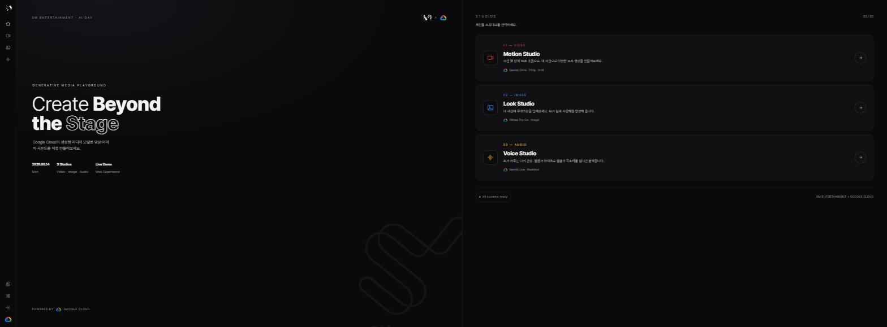
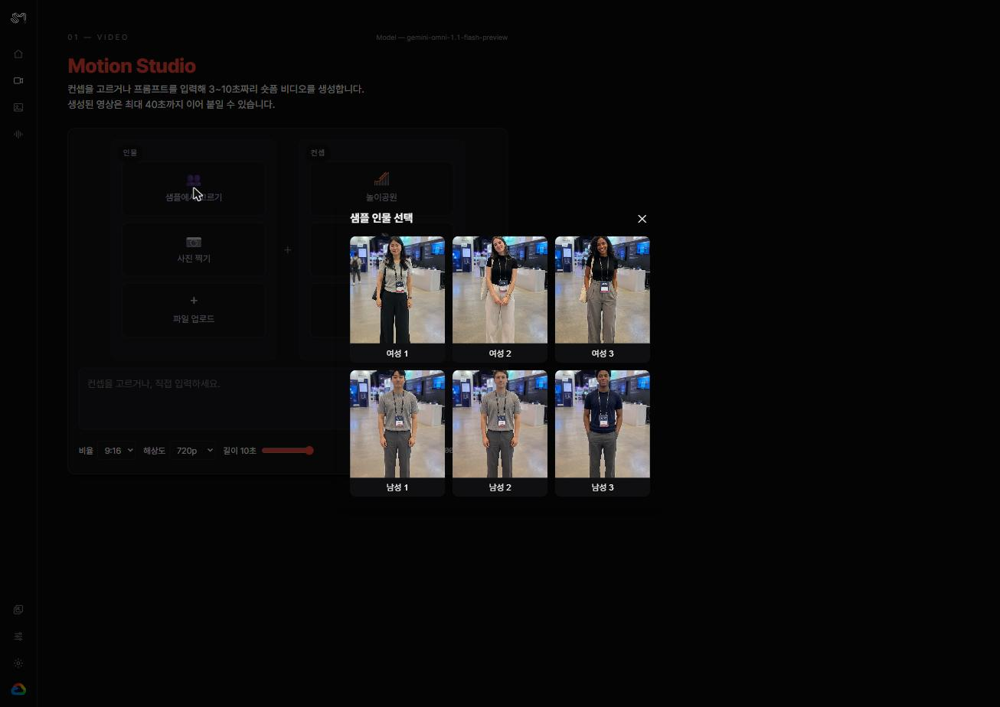
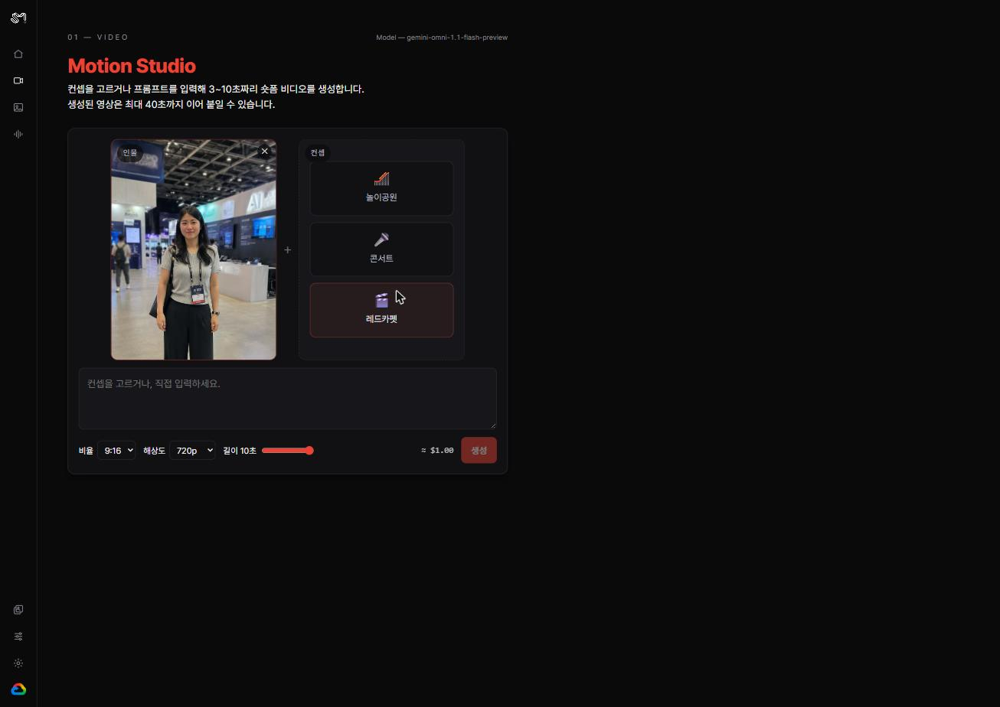
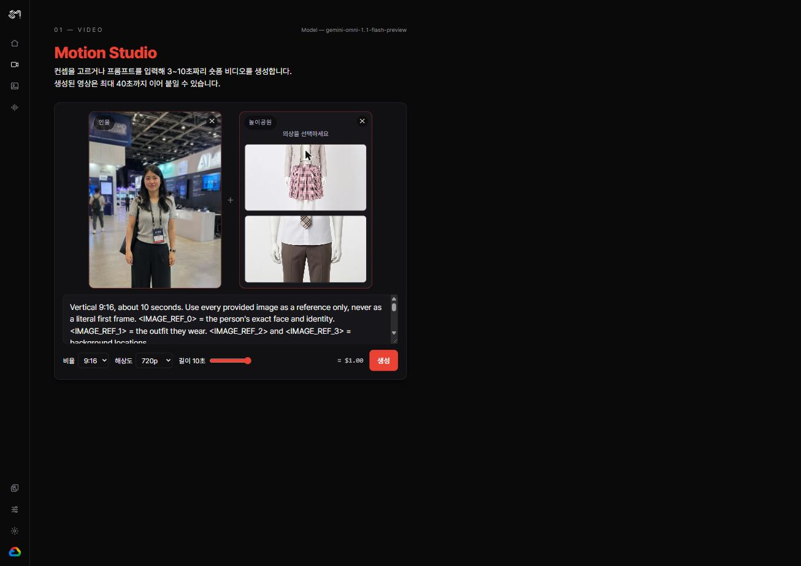
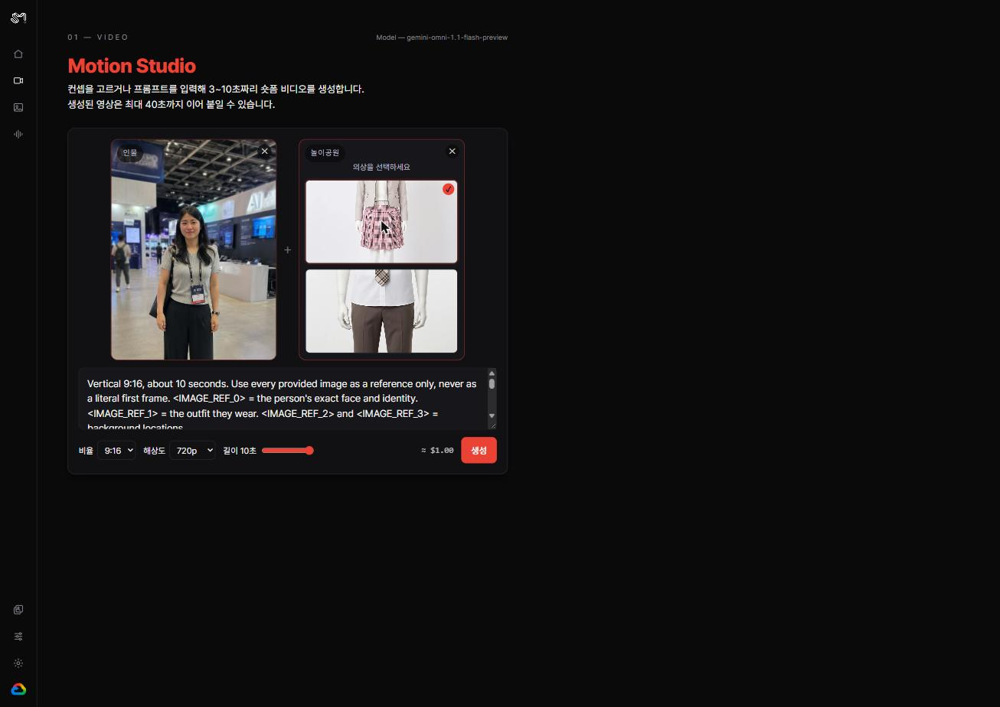
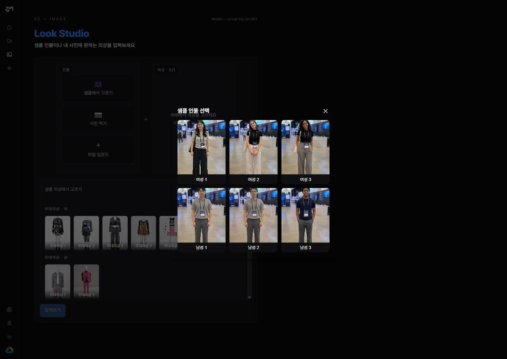
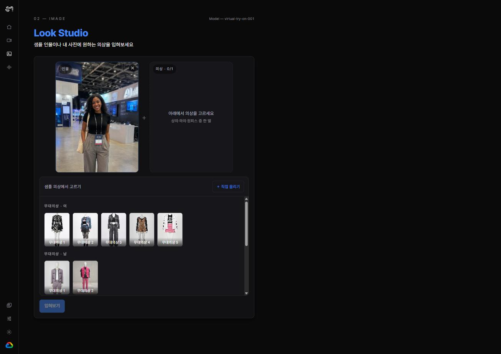
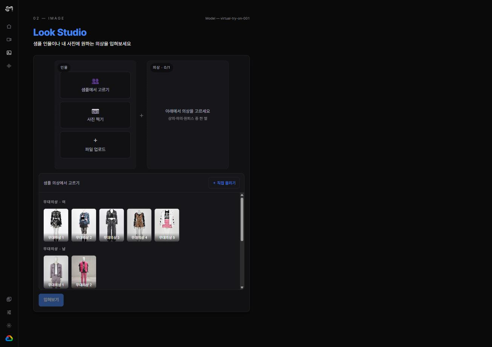
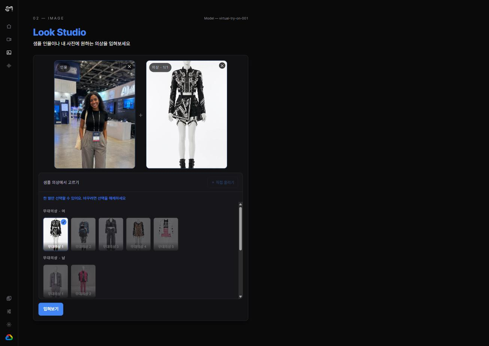

# SM × Google Cloud — AI Day 부스

**SM Entertainment AI Day** 부스에서 시연하는 Google Cloud AI 체험 웹사이트 입니다.

## 사용 API 3종

| # | 스튜디오 |모델/API |
|---|---|---|
| 01 Video | **Motion Studio** | `gemini-omni-1.1-flash-preview` |
| 02 Image | **Look Studio** | `virtual-try-on-001`|
| 03 Audio | **Voice Studio** | `gemini-live-2.5-flash`|

Cloud Run 배포 + IAP(`@mz.co.kr` 도메인 제한) 설정까지 완료된 상태다.

## 화면

**[ 허브 / 랜딩 페이지 ]**

**[01 Motion Studio]** — 인물 + 컨셉을 골라 숏폼 영상을 생성하기

| 인물 샘플 고르기 | 인물 선택 완료 | 의상 고르기 | 선택 완료 |
|---|---|---|---|
|  |  |  |  |

**[02 Look Studio]** — 인물에 아이돌 무대의상을 가상으로 입혀보기

| 인물 샘플 고르기 | 인물 선택 완료 | 의상 고르기 | 선택 완료 |
|---|---|---|---|
|  |  |  |  |

**[03 Voice Studio]** — 웹캠 얼굴을 실시간으로 보며 AI 관상가와 음성으로 대화하기

## 결과 샘플

| 스튜디오 | 입력 | 결과 |
|---|---|---|
| **Motion Studio** | 인물 사진 + 컨셉 프롬프트 | <video src="docs/result-sample/output_16306853667687879662.mp4" controls width="240"></video> |
| **Look Studio** | 인물 사진 + 무대의상 |  |

## GCP 인프라 구성

**[ 인증 — Vertex AI + ADC ]**

- API 키 대신 `gcloud auth application-default login` 기반 ADC로 인증
- 런타임 서비스 계정 `smproject-ai-runner`는 최소 권한만 부여 — Vertex AI 호출 role, 버킷 하나에 한정한 `storage.objectAdmin`, 서명 URL 발급용 `iam.serviceAccountTokenCreator` self-bind

**[ Cloud Storage ]**

- `gs://smproject-sh2/output` 버킷 운영
- Motion Studio: 생성된 영상 다운로드
- Look Studio: 결과 이미지 업로드 + 서명 URL 발급 (QR 다운로드용)

**[ Cloud Run ]**

- `gcloud run deploy --source .` + Dockerfile 멀티스테이지 빌드 → Cloud Build → Artifact Registry → 배포
- 정적 파일 + REST API + Gemini Live WebSocket을 한 프로세스에서 서빙
- 영상 생성 잡을 인메모리로 들고 있어서 `--min/max-instances 1` 고정 (인스턴스 여러 개면 폴링이 깨짐)

**[ IAP ]**

- Cloud Run에 IAP를 직접 연결 (2026 GA)
- `@mz.co.kr`, `@smtown.com` 도메인 계정만 접근 가능하도록 IAM 바인딩, 앱 안에 별도 로그인 기능은 없음
- OAuth Consent Screen - Customize(직접 생성) 으로 설정하여 타 ORG 도메인 접근 가능하도록 설정